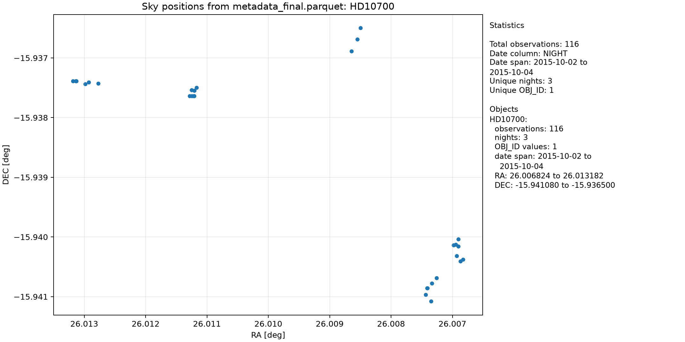
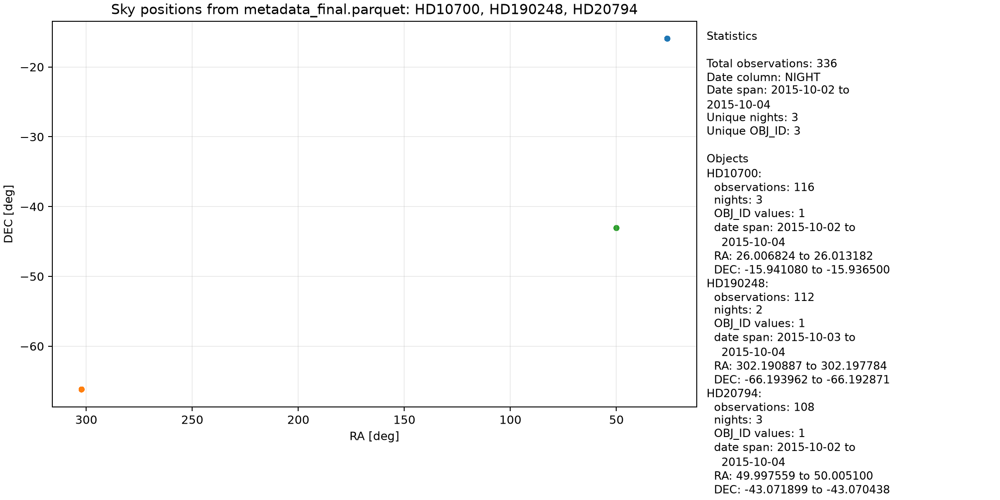

# The Telluric Dataset Project

This repository builds a HARPS atmospheric-spectrum dataset in two stages:

1. Scan selected HARPS science products, extract metadata, and assign a
   practical canonical object name using the existing fast RA-ordered grouping.
2. Stage each object's `e2ds_A` spectra and auxiliary CCF/S1D/BIS products,
   resolve its wavelength/blaze calibrations, and run Naira.

The maintained implementation now lives at the repository root: `phase1/`,
`phase2/`, and `run_pipeline.sh`. Historical copies such as `fase1`, old
`phase2`, `rp1`, and `Results` have been moved into the ignored local archive
`_deprecated/` and are not called by the launcher.

## Environment

The recommended environment manager is `uv`.

If `uv` is not available on the machine, install it first:

```bash
curl -LsSf https://astral.sh/uv/install.sh | sh
source ~/.bashrc
```

From the repository root, create/synchronize the Python environment:

```bash
uv sync
```

This creates `.venv/` with the required scientific Python packages. To run the
pipeline through the managed environment:

```bash
uv run ./run_telluric_pipeline.sh \
  --python python
```

Alternatively, activate the environment first:

```bash
source .venv/bin/activate
./run_telluric_pipeline.sh --python python
```

Quick environment sanity check:

```bash
uv run python -c "import numpy, pandas, astropy, scipy; print('env ok')"
```

## Data links

The pipeline expects local data entry points under:

```text
Data/science
Data/calib
```

These should usually be symbolic links to the real HARPS data locations. Create
or refresh them with:

```bash
./setup_data_links.sh \
  --science /path/to/HARPS/science \
  --calib /path/to/HARPS/calib
```

Use `--force` to replace existing links:

```bash
./setup_data_links.sh \
  --science /path/to/HARPS/science \
  --calib /path/to/HARPS/calib \
  --force
```

The script only creates symbolic links; it does not copy or move the underlying
data.

Check that the links point where expected:

```bash
readlink Data/science
readlink Data/calib
```

## Run

After `Data/science` and `Data/calib` are configured, run from the project root:

```bash
uv run ./run_telluric_pipeline.sh
```

By default, generated working outputs are written under:

```text
Output/phase1
Output/spectra
Output/tables
```

The science tree is expected to contain one directory per observing night. By
default Stage 1 opens only `e2ds_A`, CCF-A, S1D-A, and BIS-A FITS products. Use
`--products all` only when a complete FITS inventory is required.

Use `--star NAME` for a single-object smoke run and `--no-fresh` to reuse
existing Stage 1 Parquet files.

Use `--output /path/to/spectra` only when you want Phase 2 somewhere other than
the default `Output/spectra` folder.

Telluric PNG previews are disabled by default. To write previews for specific
orders, pass `--plot-orders`:

```bash
uv run ./run_telluric_pipeline.sh \
  --plot-orders 63
```

Accepted order selectors are a single order (`63`), a comma-separated list
(`10,20,63`), a range (`50-55`), or `all`.

## Running Phase 2 for one object

The recommended way to regenerate telluric spectra for one object is still the
root launcher. It will run Stage 1 if needed, then process only the requested
canonical `OBJECT` group:

```bash
uv run ./run_telluric_pipeline.sh \
  --star Barnards_Star
```

To reuse an existing Stage 1 table and avoid rescanning the science tree, add
`--no-fresh`:

```bash
uv run ./run_telluric_pipeline.sh \
  --star Barnards_Star \
  --no-fresh
```

To also generate diagnostic telluric figures for selected orders:

```bash
uv run ./run_telluric_pipeline.sh \
  --star Barnards_Star \
  --no-fresh \
  --plot-orders 63
```

or multiple orders:

```bash
uv run ./run_telluric_pipeline.sh \
  --star Barnards_Star \
  --no-fresh \
  --plot-orders 10,20,63
```

The main Phase 2 product is one FITS cube per object:

```text
Output/spectra/<OBJECT>/<OBJECT>/tell_spec/<OBJECT>_telluric_cube.fits
```

If Stage 1 has already produced `Output/phase1/metadata_final.parquet`, Phase 2
can also be called directly:

```bash
uv run python phase2/smoke_object_group_telluric_v2.py \
  --parquet Output/phase1/metadata_final.parquet \
  --template_config phase2/smoke_config.ini \
  --script phase2/telluric_spectra.py \
  --output Output/spectra \
  --calib Data/calib \
  --science_root Data/science \
  --tables_path Output/tables \
  --star Barnards_Star \
  --plot_orders 63 \
  --python python
```

When calling the Phase 2 script directly, note the underscore in
`--plot_orders`. The root launcher uses `--plot-orders`.

## Metadata QA: sky positions by object

To visually inspect whether one or more canonical `OBJECT` groups occupy the
expected sky position, use:

```bash
uv run python tools/plot_object_sky_positions.py \
  --object Barnards_Star
```

By default, the script reads:

```text
Output/phase1/metadata_final.parquet
```

and writes a PNG under:

```text
Output/figures/
```

The figure and terminal output include basic statistics such as number of
matched observations, date span, number of nights, number of original `OBJ_ID`
labels preserved inside each canonical `OBJECT` group, and RA/DEC ranges.

Multiple objects can be plotted together:

```bash
uv run python tools/plot_object_sky_positions.py \
  --object HD20794 \
  --object HD39091
```

or as a comma-separated list:

```bash
uv run python tools/plot_object_sky_positions.py \
  --object HD20794,HD39091
```

By default all observation dates are plotted. Restrict the date range with:

```bash
uv run python tools/plot_object_sky_positions.py \
  --object Barnards_Star \
  --date-from 2012-01-01 \
  --date-to 2012-12-31
```

The date column is chosen automatically from `NIGHT`, `DATE_OBS`, `DATE-OBS`,
`MJD_OBS`, or `MJD-OBS`. Use `--date-column COLUMN_NAME` if a different table
needs an explicit date column.

Use `--contains` for case-insensitive substring matching when searching for an
object label:

```bash
uv run python tools/plot_object_sky_positions.py \
  --object Barnard \
  --contains
```

The plot uses `OBJECT` by default and keeps the astronomical RA convention with
RA increasing toward the left. Use `--object-column OBJ_ID` to inspect original
FITS object names instead, or `--no-invert-ra` for a normal increasing x-axis.

### Example sky-position plots

Single-object plots are useful for checking whether one canonical `OBJECT`
group is internally compact on the sky:

```bash
uv run python tools/plot_object_sky_positions.py \
  --object HD10700 \
  --output Output/figures/sky_positions_HD10700.png
```



Multiple-object plots are useful for a broader sanity check of where different
targets sit on the sky:

```bash
uv run python tools/plot_object_sky_positions.py \
  --object HD10700,HD190248,HD20794 \
  --output Output/figures/sky_positions_top3.png
```



For diagnosing grouping quality, prefer single-object plots. When targets are
far apart, multi-object plots naturally compress each object's local scatter
into a small cluster.

## Stage 3 dataset build

Stage 2 writes object-oriented cubes. Stage 3 repackages them into a
date-oriented dataset under:

```text
Data/telluric/<NIGHT>/<OBJECT>_<NIGHT>_telluric_cube.fits
```

Run Stage 3 with:

```bash
uv run ./run_stage3_build_dataset.sh --overwrite
```

This also writes:

```text
Output/stage3/telluric_cube_index.parquet
Output/stage3/telluric_cube_index.csv
Output/stage3/telluric_stage3_manifest.json
```

The index table has one row per exposure. Each row points to its Stage 3 cube
and exposure index inside that cube, plus selected atmospheric/header metadata
from the source `e2ds_A` FITS file.

## Principal outputs

- `metadata_raw.parquet`: selected product inventory; `OBJ_ID` preserves the
  original FITS object name and `REL_PATH` is portable relative to the science
  root.
- `metadata.parquet`: filtered working metadata.
- `metadata_final.parquet`: grouped Stage 1 table consumed by Stage 2.
- `Output/spectra/<OBJECT>/<OBJECT>/tell_spec/<OBJECT>_telluric_cube.fits`: one
  object-oriented atmospheric transmission cube, shaped
  `(exposure, order, pixel)`.
- `Data/telluric/<NIGHT>/<OBJECT>_<NIGHT>_telluric_cube.fits`: one
  date-oriented atmospheric transmission cube, shaped
  `(exposure, order, pixel)`.
- `Output/stage3/telluric_cube_index.parquet`: exposure-level index for the
  date-oriented telluric cubes.
- `Output/spectra/<OBJECT>/processing_summary.json`: expected, valid, missing,
  and dimensionally invalid outputs for that object.

The original science header from the first exposure is retained in every
telluric cube FITS file. `TELLCUBE`, `NSPECTRA`, `NORDERS`, and `NPIX` describe
the cube output contract.

The canonical Naira template configuration uses `opt_tmpl = no`, following the
project's current reduction specification. Local HARPS `e2ds_A` inputs have 72
orders, so a two-exposure object has telluric cube shape `(2, 72, 4096)`.
